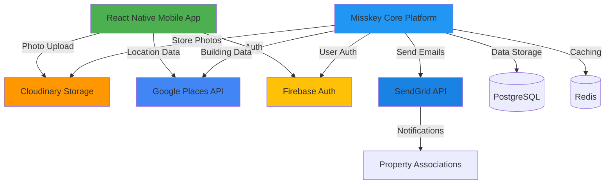

# Infrastructure Degradation Management Platform - Technology Stack & Implementation Plan

## Overview

This plan outlines the optimal third-party services and technologies to build the infrastructure degradation management platform with minimal custom programming, maximizing focus on look, feel, and user experience.

## Technology Stack Selection

### Core Platform Foundation

- **Misskey** (Node.js/TypeScript)
  - Open-source, federated social networking platform
  - ActivityPub protocol support for future interoperability
  - Modern tech stack (Node.js, TypeScript) for easier integration
  - Built-in media handling, user management, and post/timeline features
  - Self-hostable with full customization control
  - [Misskey GitHub](https://github.com/misskey-dev/misskey)

### Mobile Application

- **React Native** with **Expo**
  - Cross-platform mobile app (iOS and Android)
  - Expo Camera API for camera-only access (no gallery)
  - Expo Location API for real-time geolocation capture
  - React Native community libraries for UI components
  - [Expo Camera Documentation](https://docs.expo.dev/versions/latest/sdk/camera/)

### Photo Storage & Processing

**Recommended: Cloudinary**

- Direct camera upload API with real-time validation
- Automatic image optimization and transformation
- EXIF metadata preservation for timestamp validation
- Free tier: 25GB storage, 25GB bandwidth/month
- Paid plans: Enterprise support available
- [Cloudinary Upload API](https://cloudinary.com/documentation/image_upload_api_reference)
- Alternative: Firebase Storage (simpler, less features, Google ecosystem)

### Geolocation & Building Identification

**Recommended: Google Places API**

- Nearby Search API for finding buildings near coordinates
- Place Details API for building information
- Geocoding API for address lookup
- Pricing: Pay-per-use ($17 per 1000 requests for nearby search)
- Enterprise support available
- Comprehensive building data worldwide
- [Google Places API Documentation](https://developers.google.com/maps/documentation/places/web-service/overview)
- Alternative: Mapbox Places API (more customizable, similar pricing)

### Email Notifications

**Recommended: SendGrid**

- Transactional email API with high deliverability
- Template management for association notifications
- Email tracking and analytics
- Free tier: 100 emails/day
- Paid plans: Enterprise support with dedicated account managers
- Excellent documentation and SDK support
- [SendGrid API](https://docs.sendgrid.com/api-reference)
- Alternatives: Mailgun (better for high volume), AWS SES (cheapest but more setup)

### User Authentication

**Recommended: Firebase Authentication**

- Email/password authentication (blog-style accounts)
- Anonymous authentication option
- Integration with Firebase Storage if used
- Free tier with generous limits
- Easy React Native integration
- [Firebase Auth Documentation](https://firebase.google.com/docs/auth)
- Alternative: Auth0 (more features, better for enterprise, paid)

### Database & Backend

- **PostgreSQL** (Misskey's default database)
- **Redis** (for caching and session management)
- **Node.js/TypeScript** backend (extending Misskey)
- Consider managed services: AWS RDS (PostgreSQL), AWS ElastiCache (Redis)

## Architecture Overview



## Key Customizations to Misskey

### Required Modifications

1. **Camera-Only Photo Upload**

   - Modify upload endpoint to accept only camera-captured images
   - Validate EXIF metadata matches upload timestamp
   - Reject gallery-selected images

2. **Geo-Location Integration**

   - Add location capture before photo upload
   - Integrate Google Places API for building identification
   - Add building selection UI in mobile app

3. **Building Association System**

   - Extend database schema to link posts to buildings
   - Create building profiles/records
   - Add building timeline view

4. **Association Notification System**

   - Scrape/find association contact information
   - Integrate SendGrid for automated emails
   - Implement persistent notification scheduling
   - Track notification history

5. **Public Records View**

   - Create public-facing building pages
   - Municipality dashboard
   - Export functionality

6. **Security Features**

   - Real-time photo validation (EXIF checks)
   - Geo-location spoofing prevention
   - Rate limiting per user
   - Duplicate image detection
   - Abuse detection and account monitoring

## Implementation Phases

### Phase 1: Core Setup (Week 1-2)

- Set up Misskey instance (self-hosted or cloud)
- Configure PostgreSQL and Redis databases
- Set up React Native project with Expo
- Configure API keys for all third-party services

### Phase 2: Mobile App Foundation (Week 3-4)

- Implement camera-only photo capture (Expo Camera)
- Integrate geo-location capture (Expo Location)
- Set up Firebase Auth for user management
- Create basic UI for photo upload flow

### Phase 3: Misskey Integration (Week 5-6)

- Integrate Cloudinary for photo storage
- Connect Google Places API for building identification
- Customize Misskey's upload flow to validate real-time photos
- Extend database schema for building associations

### Phase 4: Core Features (Week 7-9)

- Building selection interface in mobile app
- Building record system in Misskey
- Post-to-building association logic
- Building timeline/feed view

### Phase 5: Notification System (Week 10-11)

- Association contact lookup system
- SendGrid integration for email notifications
- Notification scheduling and tracking
- Notification history dashboard

### Phase 6: Public Access & Dashboards (Week 12-13)

- Public building records pages
- Municipality dashboard
- Search and filter functionality
- Export/report generation

### Phase 7: Security & Anti-Abuse (Week 14-15)

- Real-time photo validation
- Geo-location spoofing prevention
- Rate limiting implementation
- Duplicate detection system
- Abuse monitoring and reporting

### Phase 8: Polish & Testing (Week 16)

- UI/UX refinement
- End-to-end testing
- Performance optimization
- Documentation

## File Structure

```
SWE_2026/
├── mobile-app/              # React Native Expo app
│   ├── src/
│   │   ├── components/      # UI components
│   │   ├── screens/         # App screens
│   │   ├── services/        # API integrations
│   │   ├── utils/           # Helper functions
│   │   └── config/          # App configuration
│   └── app.json
├── misskey-custom/          # Customized Misskey instance
│   ├── packages/
│   │   ├── backend/         # Backend customizations
│   │   └── client/          # Frontend customizations
│   └── custom-modules/      # Custom modules
├── docs/                    # Documentation
└── README.md
```

## Cost Estimation

### Monthly Costs (Estimated)

- **Cloudinary**: $0-$99/month (depending on usage, free tier available)
- **Google Places API**: $50-$200/month (pay-per-use, depends on requests)
- **SendGrid**: $0-$89.95/month (free tier: 100 emails/day, paid for more)
- **Firebase Auth**: Free (generous free tier)
- **PostgreSQL/Redis Hosting**: $25-$100/month (managed database services)
- **Misskey Hosting**: $20-$50/month (VPS or cloud instance)
- **Total Estimated**: $95-$539/month

### Development Tools (One-time/Annual)

- Expo Development Tools: Free
- React Native Developer Tools: Free
- Code Editor/IDE: Free (VS Code recommended)

## Key Integration Points

### Mobile App → Cloudinary

```typescript
// Direct camera upload to Cloudinary
const uploadPhoto = async (photoUri: string, location: Location) => {
  const formData = new FormData();
  formData.append('file', { uri: photoUri, type: 'image/jpeg' });
  formData.append('upload_preset', 'camera_only');
  formData.append('timestamp', Date.now().toString());
  
  return await fetch('https://api.cloudinary.com/v1_1/[cloud_name]/image/upload', {
    method: 'POST',
    body: formData,
  });
};
```

### Mobile App → Google Places API

```typescript
// Find nearby buildings
const findNearbyBuildings = async (lat: number, lng: number) => {
  const response = await fetch(
    `https://maps.googleapis.com/maps/api/place/nearbysearch/json?location=${lat},${lng}&radius=100&type=establishment&key=${API_KEY}`
  );
  return await response.json();
};
```

### Misskey → SendGrid

```typescript
// Send notification to association
const sendAssociationNotification = async (building: Building, issue: Issue) => {
  await sgMail.send({
    to: building.associationEmail,
    from: 'noreply@yourplatform.com',
    subject: `New Infrastructure Issue Reported - ${building.name}`,
    html: generateNotificationEmail(building, issue),
  });
};
```

## Risk Mitigation

1. **Misskey Customization Complexity**

   - Start with minimal changes
   - Fork Misskey repository for custom modifications
   - Maintain compatibility with upstream updates

2. **API Rate Limits**

   - Implement caching for Google Places API
   - Use batch requests where possible
   - Monitor usage and set up alerts

3. **Photo Validation Security**

   - Multiple validation layers (EXIF, timestamp, location)
   - Server-side validation in addition to client-side
   - Regular security audits

4. **Scalability**

   - Use managed database services for scaling
   - Implement CDN for photo delivery (Cloudinary includes this)
   - Consider load balancing for Misskey instance

## Next Steps

1. Set up development environment (Node.js, React Native, Expo CLI)
2. Create accounts for all third-party services
3. Fork/clone Misskey repository
4. Initialize React Native Expo project
5. Set up PostgreSQL and Redis databases
6. Begin Phase 1 implementation

## Documentation References

- [Misskey GitHub Repository](https://github.com/misskey-dev/misskey)
- [Expo Camera Documentation](https://docs.expo.dev/versions/latest/sdk/camera/)
- [Cloudinary Upload API](https://cloudinary.com/documentation/image_upload_api_reference)
- [Google Places API Documentation](https://developers.google.com/maps/documentation/places/web-service/overview)
- [SendGrid API Documentation](https://docs.sendgrid.com/api-reference)
- [Firebase Authentication Documentation](https://firebase.google.com/docs/auth)