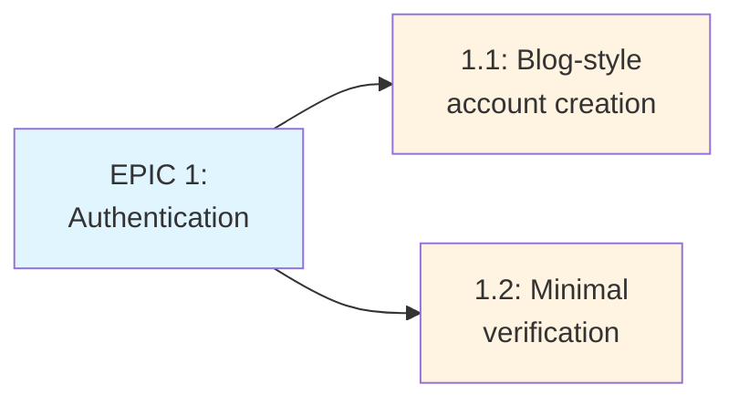
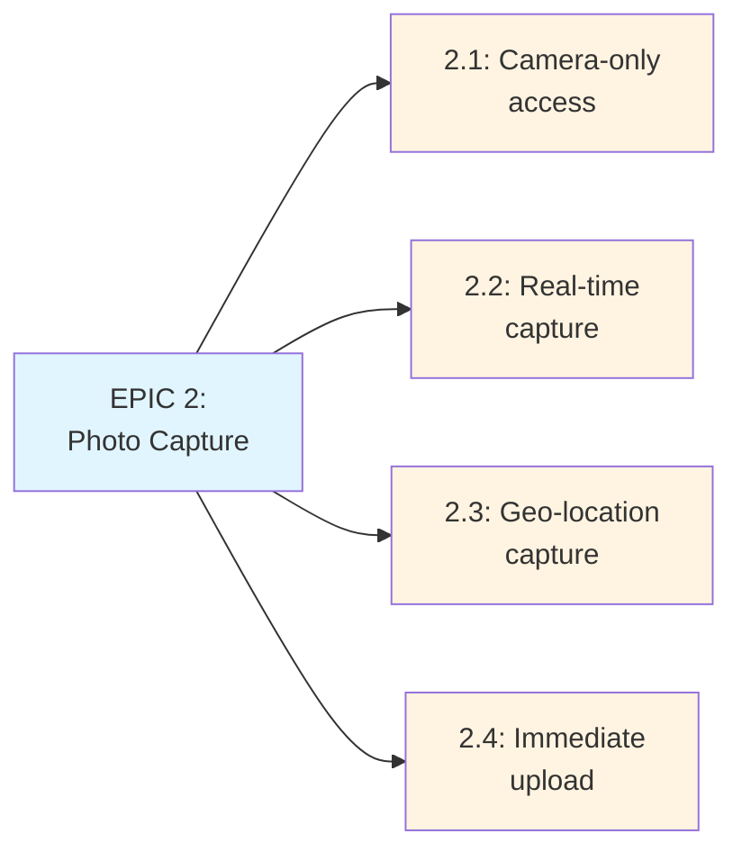
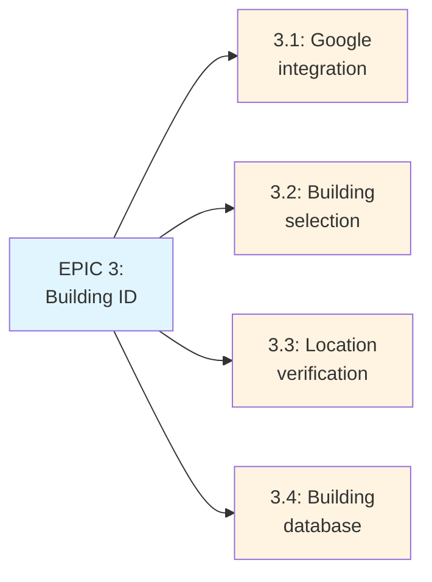
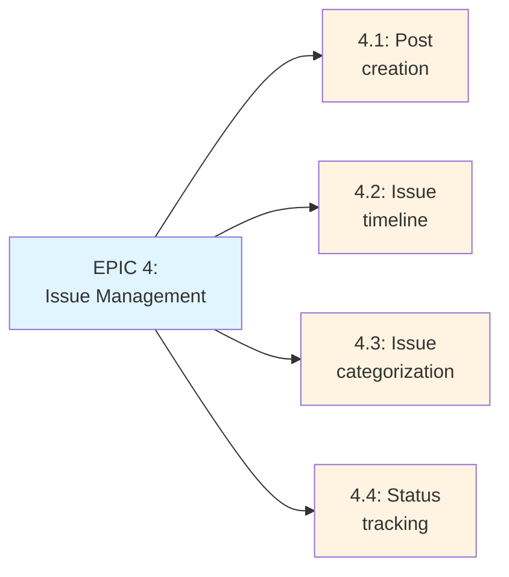
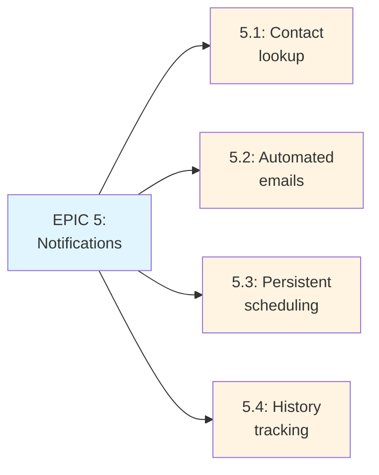
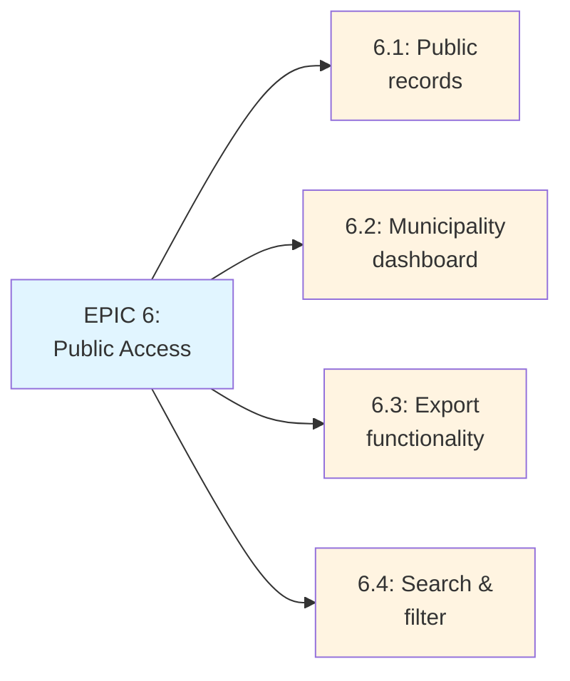
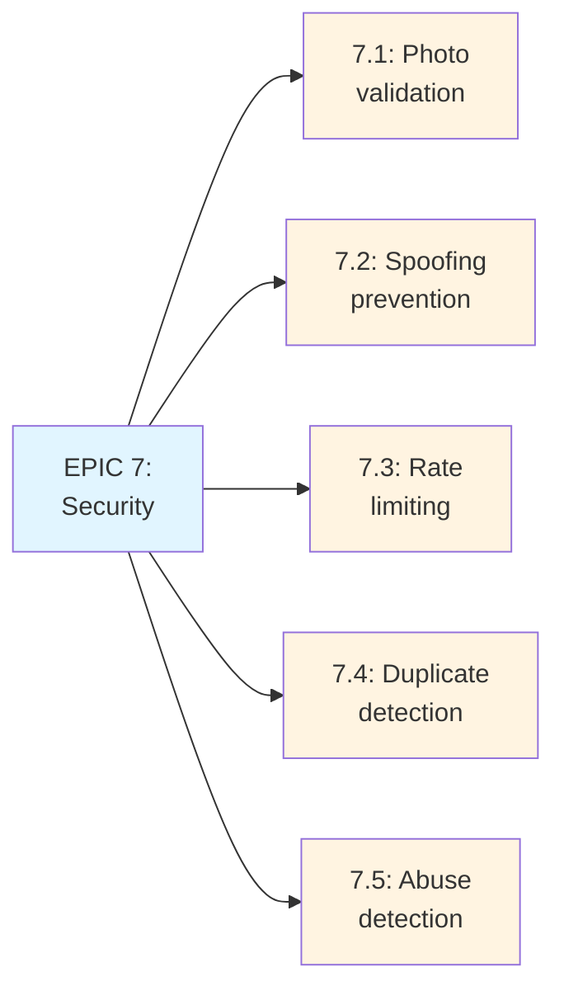

# Infrastructure Degradation Management Platform - Issue Modeling Plan

## Project Overview
An accountability platform for infrastructure degradation that allows users to document issues in real-time with geo-location tagging, similar to Instagram's photo upload model but focused on holding property associations accountable.

## Issue Breakdown - Epics Overview

```mermaid
graph TD
    Root[Infrastructure Degradation Platform]
    
    Root --> Epic1[EPIC 1: Authentication]
    Root --> Epic2[EPIC 2: Photo Capture]
    Root --> Epic3[EPIC 3: Building ID]
    Root --> Epic4[EPIC 4: Issue Management]
    Root --> Epic5[EPIC 5: Notifications]
    Root --> Epic6[EPIC 6: Public Access]
    Root --> Epic7[EPIC 7: Security]
    
    Epic1 --> S1_1[Blog-style accounts]
    Epic1 --> S1_2[Minimal verification]
    
    Epic2 --> S2_1[Camera-only access]
    Epic2 --> S2_2[Real-time capture]
    Epic2 --> S2_3[Geo-location]
    Epic2 --> S2_4[Immediate upload]
    
    Epic3 --> S3_1[Google integration]
    Epic3 --> S3_2[Building selection]
    Epic3 --> S3_3[Location verification]
    Epic3 --> S3_4[Building database]
    
    Epic4 --> S4_1[Post creation]
    Epic4 --> S4_2[Issue timeline]
    Epic4 --> S4_3[Categorization]
    Epic4 --> S4_4[Status tracking]
    
    Epic5 --> S5_1[Contact lookup]
    Epic5 --> S5_2[Automated emails]
    Epic5 --> S5_3[Persistent scheduling]
    Epic5 --> S5_4[History tracking]
    
    Epic6 --> S6_1[Public records]
    Epic6 --> S6_2[Municipality dashboard]
    Epic6 --> S6_3[Export functionality]
    Epic6 --> S6_4[Search & filter]
    
    Epic7 --> S7_1[Photo validation]
    Epic7 --> S7_2[Spoofing prevention]
    Epic7 --> S7_3[Rate limiting]
    Epic7 --> S7_4[Duplicate detection]
    Epic7 --> S7_5[Abuse detection]
    
    style Root fill:#d4e1f5
    style Epic1 fill:#e1f5ff
    style Epic2 fill:#e1f5ff
    style Epic3 fill:#e1f5ff
    style Epic4 fill:#e1f5ff
    style Epic5 fill:#e1f5ff
    style Epic6 fill:#e1f5ff
    style Epic7 fill:#e1f5ff
```

## Detailed Epic Breakdown

### EPIC 1: User Authentication & Account Management

### EPIC 2: Real-Time Photo Capture & Geo-Location

### EPIC 3: Building Identification & Tagging

### EPIC 4: Issue Management & Records

### EPIC 5: Association Notifications

### EPIC 6: Public Visibility & Third-Party Access

### EPIC 7: Security & Anti-Defamation Measures

## Detailed Issue Breakdown

### EPIC 1: User Authentication & Account Management
**Goal**: Enable users to create accounts without strict verification requirements

- **Story 1.1**: Blog-style account creation
  - Users can create accounts with username and optional email
  - No real name verification required
  - Simple registration flow

- **Story 1.2**: Account profile management
  - Basic profile information
  - Account settings
  - Privacy preferences

### EPIC 2: Real-Time Photo Capture & Geo-Location
**Goal**: Ensure photos are taken in real-time at actual locations

- **Story 2.1**: Camera-only access implementation
  - Request only camera permissions (no gallery access)
  - Implement camera capture interface
  - Validate no gallery image uploads allowed

- **Story 2.2**: Real-time photo capture
  - In-app camera interface
  - Must take photo through app (not from gallery)
  - Immediate upload after capture

- **Story 2.3**: Geo-location capture
  - Get GPS coordinates at time of photo
  - Store location metadata with photo
  - Handle location permission requests

- **Story 2.4**: Upload validation
  - Verify photo timestamp matches upload time
  - Prevent uploading previously saved photos
  - Validate location data is present

### EPIC 3: Building Identification & Tagging
**Goal**: Accurately link photos to specific buildings using geo-location

- **Story 3.1**: Google search services integration
  - Integrate with Google Places API or similar
  - Query nearby buildings based on coordinates
  - Return list of potential buildings

- **Story 3.2**: Building selection interface
  - Display 2-3 nearby buildings to user
  - Allow user to select correct building
  - Handle imprecise location scenarios

- **Story 3.3**: Building database
  - Store building information
  - Maintain building records
  - Link posts to building IDs

### EPIC 4: Issue Management & Records
**Goal**: Maintain comprehensive records of infrastructure issues

- **Story 4.1**: Issue post creation
  - Create post with photo and building link
  - Store post metadata (timestamp, location, user)
  - Tag post to specific building

- **Story 4.2**: Building issue timeline
  - Display all issues for a building chronologically
  - Filter by date, type, status
  - Maintain permanent record

- **Story 4.3**: Issue categorization
  - Allow users to categorize issues (structural, electrical, etc.)
  - Support severity ratings
  - Tag system for organization

- **Story 4.4**: Issue status tracking
  - Track if issue has been addressed
  - Allow status updates
  - Resolution tracking

### EPIC 5: Association Notifications
**Goal**: Hold associations accountable through persistent notifications

- **Story 5.1**: Association contact lookup
  - Scrape/find publicly available contact information
  - Store association contacts per building
  - Update contact information when available

- **Story 5.2**: Automated notification system
  - Send email/notification when new issue is posted
  - Include issue details and photo
  - Link to building record

- **Story 5.3**: Persistent notification scheduling
  - Re-send notifications if no acknowledgment
  - Escalation schedule
  - Configurable notification frequency

- **Story 5.4**: Notification tracking
  - Log all notifications sent
  - Track open/read status
  - Generate notification reports

### EPIC 6: Public Visibility & Third-Party Access
**Goal**: Enable transparency for municipalities and third parties

- **Story 6.1**: Public building records view
  - Public-facing building pages
  - Display all issues (no login required)
  - Building statistics and trends

- **Story 6.2**: Municipality dashboard
  - View all buildings in jurisdiction
  - Compliance tracking
  - Issue trend analysis

- **Story 6.3**: Export functionality
  - Generate PDF reports
  - Export data for analysis
  - API access for third parties

- **Story 6.4**: Search and filter
  - Search buildings by name/address
  - Filter by issue type, date range, status
  - Advanced search capabilities

### EPIC 7: Security & Anti-Defamation Measures
**Goal**: Prevent abuse, spoofing, and false reporting

- **Story 7.1**: Real-time photo validation
  - Verify EXIF data matches upload time
  - Check for photo editing/manipulation
  - Validate photo is from camera (not gallery)

- **Story 7.2**: Geo-location spoofing prevention
  - Validate GPS coordinates are reasonable
  - Check for location spoofing apps
  - Cross-reference with network location

- **Story 7.3**: Rate limiting
  - Limit posts per user per day
  - Prevent mass upload spam
  - Implement CAPTCHA if needed

- **Story 7.4**: Duplicate detection
  - Image similarity checking
  - Flag potential duplicate uploads
  - Prevent same photo multiple times

- **Story 7.5**: Abuse detection
  - Monitor for bot accounts
  - Detect suspicious posting patterns
  - Flag potential defamation attempts
  - Account suspension system

## Technical Considerations

### Constraints
- Must use Google search services (avoiding expensive precision APIs)
- Camera-only access (no gallery)
- Public contact information only for associations
- Privacy regulations compliance

### Security Priorities
1. Real-time photo requirement (no saved photos)
2. Geo-location validation
3. Rate limiting per user
4. Duplicate detection
5. Abuse monitoring

### Key Integrations
- Google Places/Search API for building identification
- GPS/Geo-location services
- Email/notification services
- Camera API (mobile)
